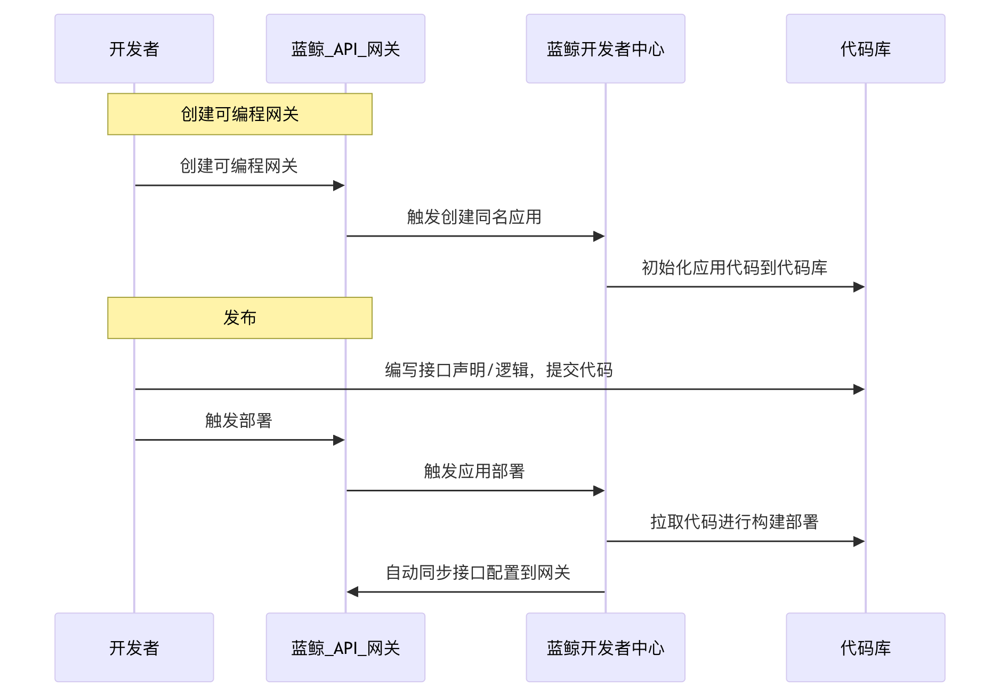
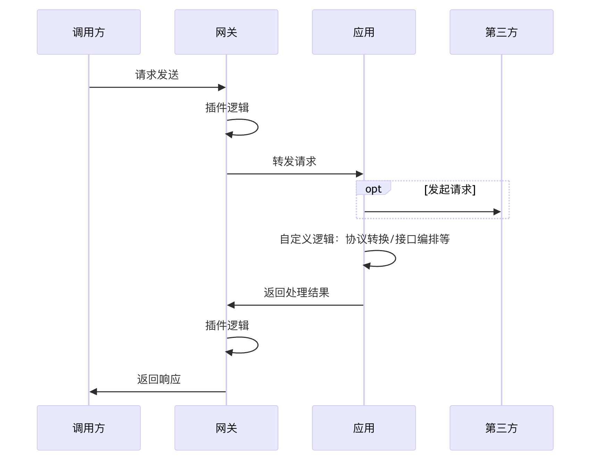
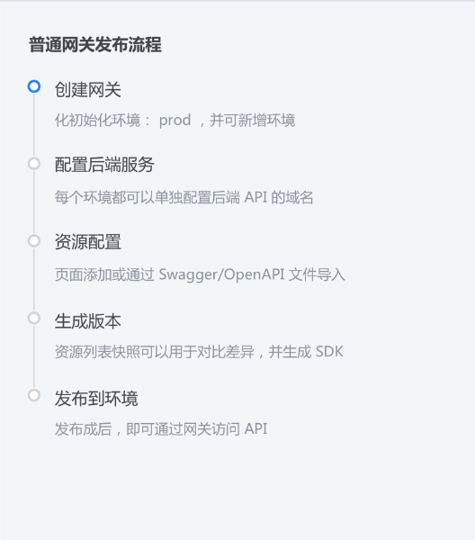
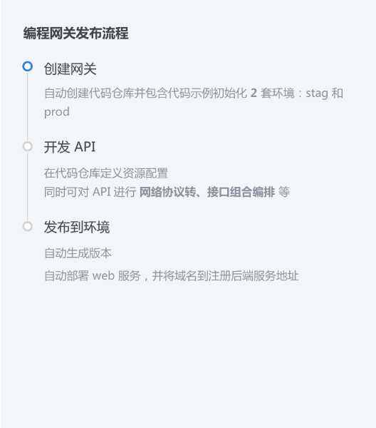
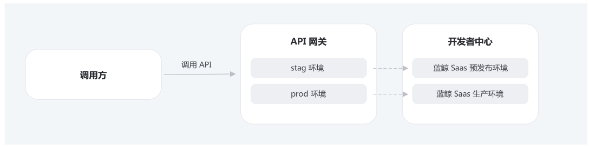

# 设计文档

蓝鲸可编程网关，是依托于蓝鲸 PaaS 平台，用户可以基于可编程网关开发框架，通过编码的方式，实现普通网关插件难以实现的一些需求，例如例如封装多个接口调用、接口编排、协议转换等。

- 蓝鲸 PaaS 平台，负责维护应用的生命周期
- 蓝鲸 API 网关，负责维护接口的生命周期
- 蓝鲸可编程网关开发框架，将流程中逻辑全部自动化，封装暴露出最简的接口供用户实现
- 应用开发者：只需在代码中声明对应接口配置/插件配置等，专注于接口逻辑开发

## 可编程网关的理念

Code As Gateway Definition，所有的 API 接口/插件/逻辑以代码中的 API 声明和插件声明为准；

## 可编程网关的能力

> 应用相当于一个封装层，介于网关与第三方系统之间，可以实现复杂逻辑

- 通过编码，实现自定义逻辑封装，包括多个接口调用，接口编排，协议转换，再次代理等
- 通过编码，声明网关接口/插件等，自动化注册并发布到蓝鲸 API 网关

## 普通网关 vs 可编程网关

- 蓝鲸共享网关：产品化页面表单配置
- 蓝鲸可编程网关：Code As Gateway Definition，所有的 API 接口/插件/逻辑以代码为准；运行时自动生成配置注册到 蓝鲸 API 网关；

在蓝鲸共享网关的页面上，新建网关时提供对应的产品入口（开发者），开发者新建网关后，将会自动将可编程网关框架，在蓝鲸 PaaS 平台初始化对应的应用，开发者编码对应的 API 逻辑之后，声明 API 对应的 OpenAPI 配置，以及蓝鲸共享网关的一些公共插件配置，在部署时，将会自动注册网关并发布。

## 可编程网关开发框架

- [python 框架](./python.md)
- [golang 框架](./golang.md)
